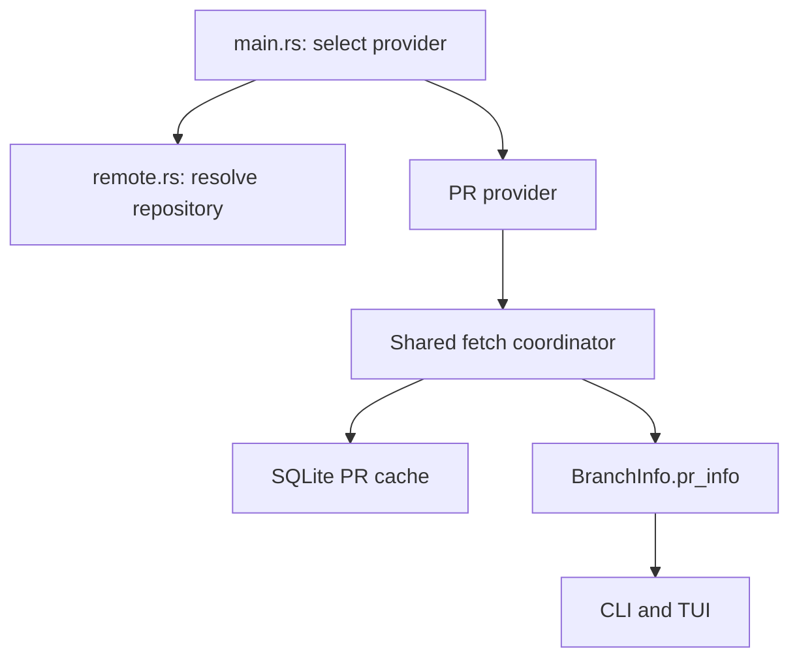

# Bitbucket Data Center Pull Request Integration Specification

Status: Proposed implementation specification Target project: `rust/local-git-branch-cleanup-tui`
Repository: `EmilIvanichkovv/omni-scripts` Source snapshot reviewed: `main`, 2026-07-31 Acceptance
testing target: any Bitbucket Data Center instance and repository the tester can access. All
host/project/repository names in this document (`bitbucket.example.com`, `PROJ`, `demo-repo`) are
placeholders.

## 1. Purpose

Extend `local-git-branch-cleanup-tui` so its existing GitHub pull-request integration is also
available for Bitbucket Data Center repositories.

The Bitbucket implementation must provide the same user-visible behavior that currently exists
behind `--github`:

- Find the most recent pull request associated with each local branch.
- Include open, merged, and closed/declined pull requests.
- Display the pull-request state and identifier in CLI and TUI modes.
- Display the pull-request title in the TUI details pane.
- Open the selected pull request in the default browser with the `o` key.
- Reuse the existing one-hour SQLite cache, including negative caching for branches with no pull
  request.
- Fetch cache misses asynchronously with bounded concurrency.
- Preserve the hidden sequential-fetch and fetch-only benchmarking modes.
- Leave all local branch classification and deletion safety behavior unchanged.

This document is implementation-ready. Agents should follow the named types, configuration
precedence, endpoint behavior, error rules, tests, and acceptance criteria unless a concrete
incompatibility is discovered in the checked-out code or target Bitbucket version.

## 2. Scope

### 2.1 In scope

| Existing GitHub behavior                           | Required Bitbucket Data Center behavior                                                   |
| -------------------------------------------------- | ----------------------------------------------------------------------------------------- |
| Enabled explicitly with `--github`                 | Enabled explicitly with `--bitbucket`                                                     |
| Repository derived from `origin`                   | Base URL, project key, and repository slug derived from `origin`, with explicit overrides |
| Authentication delegated to `gh`                   | Bearer authentication with an HTTP access token from `BITBUCKET_TOKEN`                    |
| `gh pr list --head <branch> --state all --limit 1` | Data Center REST lookup filtered by source branch, all states, newest first, limit 1      |
| GitHub `OPEN`                                      | `PrState::Open`                                                                           |
| GitHub `MERGED`                                    | `PrState::Merged`                                                                         |
| GitHub `CLOSED`                                    | `PrState::Closed`                                                                         |
| No PR is cached                                    | Empty Bitbucket result is cached                                                          |
| PR number, title, URL cached                       | Bitbucket PR ID, title, state, and URL cached in the same model                           |
| `github_enabled` controls PR UI                    | Provider-neutral PR integration state controls the same UI                                |
| `o` opens GitHub PR URL                            | `o` opens Bitbucket PR URL                                                                |

### 2.2 Out of scope

- Bitbucket Cloud (`bitbucket.org`) and its `/2.0` API.
- Creating, approving, declining, merging, commenting on, or otherwise modifying pull requests.
- Deleting remote branches.
- Changing branch classification based on pull-request state.
- Storing tokens in SQLite, config files, command-line arguments, logs, or crash reports.
- Automatically enabling network integration merely because a Bitbucket remote is detected.
- Supporting multiple remotes in the first version. Continue to use `origin`.
- Disabling TLS validation or adding an insecure TLS mode.
- Replacing the current SQLite cache implementation.

## 3. Existing implementation assessment

The current implementation is not isolated to a GitHub client. GitHub-specific assumptions are
present in the domain model, orchestration, cache comments, UI state, help text, and remote parsing.

### 3.1 Current modules and relevant behavior

| File                        | Current responsibility relevant to this work                                                                                                                                        |
| --------------------------- | ----------------------------------------------------------------------------------------------------------------------------------------------------------------------------------- |
| `src/main.rs`               | Parses `--github`, checks for `gh`, opens the PR cache, launches fetches, prints GitHub-specific status, passes `github_enabled` to CLI/TUI modes                                   |
| `src/git.rs`                | Defines `PrState` and `PrInfo`, stores `pr_info` on `BranchInfo`, parses an `owner/repo` slug, executes `gh`, manually parses JSON, performs bounded concurrent lookups, opens URLs |
| `src/cache.rs`              | Stores one PR or a negative result per repository/branch with a one-hour TTL                                                                                                        |
| `src/app.rs`                | Stores `github_enabled` and opens the selected branch's `PrInfo.url`                                                                                                                |
| `src/ui.rs`                 | Conditionally renders the PR column, PR details, legend, and GitHub-specific help text                                                                                              |
| `tests/integration_test.rs` | Covers executable behavior but does not provide a mock HTTP API                                                                                                                     |

### 3.2 Current behavior that must be preserved

The following current details are intentional compatibility requirements:

1. `PrState` has exactly three user-facing states: `Open`, `Merged`, and `Closed`.
2. `PrInfo` contains a numeric identifier, state, title, and browser URL.
3. `BranchInfo.pr_info` remains optional.
4. PR lookup does not affect `BranchStatus` or deletion eligibility.
5. Cache TTL remains one hour.
6. Cache entries older than 30 days are evicted at startup.
7. A cached `None` means a successful lookup found no PR and prevents another network call during
   the TTL.
8. Cache hits are applied synchronously before cache misses are fetched.
9. Fetch results are written back to branches in original branch order.
10. The existing table column, details pane, legend, colors, and `o` shortcut retain their behavior.
11. `--sequential` and `--fetch-only` remain hidden benchmarking options and work with either
    provider.
12. GitHub behavior remains functional and `--github` remains backward compatible.

### 3.3 Existing technical limitations to correct during this work

The provider refactor must correct these limitations because simply adding Bitbucket conditionals
would make error handling unsafe:

- `Option<PrInfo>` currently represents both "no PR" and "lookup failed." A failed API request must
  never be written as a negative cache entry.
- `get_repo_slug()` is GitHub-shaped. For a Data Center clone URL such as `/scm/proj/demo-repo.git`,
  it returns an unusable three-part path.
- The cache partition key is only `owner/repo`, so repositories on different hosts or providers can
  collide.
- UI state and help text use `github_enabled` even though the rendered data model is already
  provider-independent.
- GitHub JSON is parsed manually. Bitbucket HTTP responses must use typed `serde` deserialization.
- A network integration requested explicitly by the user needs actionable 401, 403, 404, rate-limit,
  TLS, and malformed-response errors.

## 4. User experience and CLI contract

### 4.1 New command-line options

Add the following options to `Args` in `src/main.rs`:

| Option                 | Short | Value  | Behavior                                                                      |
| ---------------------- | ----- | ------ | ----------------------------------------------------------------------------- |
| `--bitbucket`          | `-b`  | flag   | Enable Bitbucket Data Center PR integration                                   |
| `--bitbucket-base-url` | none  | URL    | Override the derived Data Center base URL, including an optional context path |
| `--bitbucket-project`  | none  | string | Override the derived project key                                              |
| `--bitbucket-repo`     | none  | string | Override the derived repository slug                                          |

Rules:

- `--github` and `--bitbucket` MUST conflict in `clap`.
- Each `--bitbucket-*` override MUST require `--bitbucket`.
- The HTTP token MUST NOT be accepted as a CLI argument.
- Existing flags and short forms MUST remain unchanged.
- If neither provider flag is present, the tool MUST perform no PR-related network or subprocess
  work.

Recommended `clap` shape:

```rust
#[arg(long, short = 'g', conflicts_with = "bitbucket")]
github: bool,

#[arg(long, short = 'b', conflicts_with = "github")]
bitbucket: bool,

#[arg(long, requires = "bitbucket")]
bitbucket_base_url: Option<String>,

#[arg(long, requires = "bitbucket")]
bitbucket_project: Option<String>,

#[arg(long, requires = "bitbucket")]
bitbucket_repo: Option<String>,
```

### 4.2 Environment variables

| Variable             | Required                       | Purpose                                                        |
| -------------------- | ------------------------------ | -------------------------------------------------------------- |
| `BITBUCKET_TOKEN`    | Yes when `--bitbucket` is used | Bitbucket Data Center HTTP access token sent as a Bearer token |
| `BITBUCKET_BASE_URL` | No                             | Base URL fallback when the CLI override is absent              |
| `BITBUCKET_PROJECT`  | No                             | Project-key fallback when the CLI override is absent           |
| `BITBUCKET_REPO`     | No                             | Repository-slug fallback when the CLI override is absent       |

Configuration precedence for every non-secret value MUST be:

1. Command-line override.
2. Environment variable.
3. Value derived from `origin`.

`BITBUCKET_TOKEN` MUST be read directly with `std::env::var` after argument parsing. It MUST NOT be
placed in `Args`, because `Args` derives `Debug`.

The token is a Bitbucket Data Center HTTP access token, not a Bitbucket Cloud API token and not a
Git password. Bearer authentication does not require the user's email address.

### 4.3 Expected usage

With a conventional Data Center clone URL, the normal invocation is:

```bash
export BITBUCKET_TOKEN='<HTTP_ACCESS_TOKEN>'
local-git-branch-cleanup-tui --bitbucket
```

The implementation must derive:

```text
base URL:       https://bitbucket.example.com
project key:    PROJ
repository:     demo-repo
```

If remote parsing cannot derive these values, the supported explicit invocation is:

```bash
export BITBUCKET_TOKEN='<HTTP_ACCESS_TOKEN>'
local-git-branch-cleanup-tui \
  --bitbucket \
  --bitbucket-base-url 'https://bitbucket.example.com' \
  --bitbucket-project 'PROJ' \
  --bitbucket-repo 'demo-repo'
```

Documentation SHOULD demonstrate a hidden token prompt rather than placing the token directly in
shell history.

### 4.4 Startup behavior

When `--bitbucket` is selected, startup MUST follow this order:

1. Verify the local Git repository and classify local branches as today.
2. Resolve and validate Bitbucket configuration.
3. Require a non-empty `BITBUCKET_TOKEN`.
4. Construct the HTTP client.
5. Validate repository access with one repository metadata request.
6. Open and prune the cache.
7. Populate cache hits.
8. Fetch cache misses.
9. Print a concise fetch summary.
10. Enter CLI/TUI mode, or exit when `--fetch-only` is active.

Fatal configuration or authentication errors MUST occur before the TUI switches to the alternate
terminal screen.

## 5. Provider-neutral architecture

### 5.1 Target module layout

Create a provider layer and keep local Git operations separate from hosting-provider operations:

```text
src/
├── app.rs
├── cache.rs
├── git.rs
├── main.rs
├── remote.rs
├── ui.rs
└── pr/
    ├── mod.rs
    ├── bitbucket.rs
    └── github.rs
```

Responsibilities:

- `git.rs`: local Git commands, branch classification, branch deletion, and `BranchInfo`.
- `remote.rs`: read and parse `origin`; return a normalized remote identity.
- `pr/mod.rs`: provider-neutral domain types, trait, fetch coordinator, and fetch report.
- `pr/github.rs`: existing `gh` behavior moved behind the provider interface.
- `pr/bitbucket.rs`: Data Center configuration, HTTP client, DTOs, state mapping, and REST calls.
- `cache.rs`: provider-neutral caching of `PrInfo`.
- `main.rs`: provider selection and orchestration.
- `app.rs` and `ui.rs`: provider-neutral display state.



### 5.2 Shared domain types

Move `PrState` and `PrInfo` from `git.rs` into `pr/mod.rs`. Preserve their external semantics.

```rust
#[derive(Debug, Clone, Copy, PartialEq, Eq)]
pub enum PrProviderKind {
    GitHub,
    BitbucketDataCenter,
}

impl PrProviderKind {
    pub fn label(self) -> &'static str {
        match self {
            Self::GitHub => "GitHub",
            Self::BitbucketDataCenter => "Bitbucket",
        }
    }
}

#[derive(Debug, Clone, PartialEq, Eq)]
pub enum PrState {
    Open,
    Merged,
    Closed,
}

#[derive(Debug, Clone, PartialEq, Eq)]
pub struct PrInfo {
    pub number: u64,
    pub state: PrState,
    pub title: String,
    pub url: String,
}
```

Keep the `number` field name to avoid an unnecessary cache/UI migration. For Bitbucket, `number`
contains the Data Center pull request `id`.

`BranchInfo` continues to contain:

```rust
pub pr_info: Option<PrInfo>
```

### 5.3 Provider interface

Add `async-trait` and define:

```rust
#[async_trait::async_trait]
pub trait PullRequestProvider: Send + Sync {
    fn kind(&self) -> PrProviderKind;
    fn cache_key(&self) -> String;
    fn max_concurrency(&self) -> usize;

    async fn validate(&self) -> Result<(), PrProviderError>;

    async fn get_pr_for_branch(
        &self,
        branch_name: &str,
    ) -> Result<Option<PrInfo>, PrProviderError>;
}
```

Contract:

- `Ok(Some(pr))`: lookup succeeded and found a PR.
- `Ok(None)`: lookup succeeded and found no PR.
- `Err(error)`: lookup failed. The result MUST NOT be stored as a negative cache entry.
- `validate()` MUST verify provider prerequisites and repository access before branch lookups begin.

Per-provider `validate()` semantics:

- Bitbucket: perform the repository metadata request from section 7.2. Any failure is fatal (section
  9.4).
- GitHub: check `gh` availability via the existing `is_gh_cli_available()` check only. Do NOT add a
  `gh auth status` call or any new subprocess. A missing `gh` CLI MUST preserve the current
  non-fatal behavior: print the existing warning, disable PR integration for the run, and continue
  into CLI/TUI mode with exit code 0. This is required by the backward-compatibility rule in section
  3.2 item 12 and overrides the general fatality rule in section 9.4 for this one case.

If agents prefer enum dispatch over `async-trait`, that is acceptable only if the same observable
interface and test seams are retained. Provider-specific branches MUST NOT be spread through the
fetch coordinator, cache, app state, or UI.

### 5.4 Provider error type

Define a typed error with at least these categories:

```rust
pub enum PrProviderError {
    Configuration(String),
    Authentication(String),
    Forbidden(String),
    NotFound(String),
    RateLimited { retry_after: Option<Duration> },
    Transport(String),
    Tls(String),
    InvalidResponse(String),
    ProviderUnavailable(String),
}
```

The type may use `thiserror`; alternatively, implement `Display` manually. Display output MUST be
actionable and MUST NOT include the token, `Authorization` header, or complete response headers.

## 6. Remote and repository resolution

### 6.1 Shared remote model

Add a normalized model in `remote.rs`:

```rust
pub struct GitRemote {
    pub name: String,
    pub raw_url: String,
    pub host: Option<String>,
    pub path_segments: Vec<String>,
    pub transport: RemoteTransport,
}

pub enum RemoteTransport {
    Http,
    Https,
    Ssh,
    ScpLike,
    Local,
}
```

`read_origin()` MUST execute `git remote get-url origin`, check the exit status, trim the output,
and return a configuration error if no usable `origin` exists.

### 6.2 Bitbucket repository model

```rust
pub struct BitbucketRepository {
    pub base_url: url::Url,
    pub project_key: String,
    pub repository_slug: String,
}
```

Normalization rules:

- Remove a trailing slash from the base URL.
- Preserve a configured context path such as `/bitbucket`.
- Reject base URLs whose scheme is not `http` or `https`.
- Strip a final `.git` suffix from the repository slug.
- Reject empty project and repository components.
- Canonicalize an inferred project key to ASCII uppercase.
- Preserve explicitly provided project/repository values except for surrounding whitespace
  validation.
- Never include credentials from a remote URL in the resulting base URL or error output.

### 6.3 Required remote formats

The parser MUST have unit tests for these formats:

| Remote URL                                                | Derived base URL                | Project | Repository  |
| --------------------------------------------------------- | ------------------------------- | ------- | ----------- |
| `https://bitbucket.example.com/scm/proj/demo-repo.git`    | `https://bitbucket.example.com` | `PROJ`  | `demo-repo` |
| `https://host/bitbucket/scm/proj/demo-repo.git`           | `https://host/bitbucket`        | `PROJ`  | `demo-repo` |
| `http://host:7990/scm/proj/demo-repo.git`                 | `http://host:7990`              | `PROJ`  | `demo-repo` |
| `ssh://git@bitbucket.example.com:7999/proj/demo-repo.git` | `https://bitbucket.example.com` | `PROJ`  | `demo-repo` |
| `git@bitbucket.example.com:proj/demo-repo.git`            | `https://bitbucket.example.com` | `PROJ`  | `demo-repo` |

For SSH transports, do not reuse the SSH port as the HTTPS port. Use `https://<host>` and require
`--bitbucket-base-url` or `BITBUCKET_BASE_URL` when the server has a nonstandard HTTP port or
context path.

### 6.4 Resolution failures

When parsing fails, return one message containing:

- the sanitized remote shape;
- the missing component;
- the exact override flags the user can supply.

Example:

```text
Could not derive the Bitbucket project key from origin. Supply --bitbucket-project and, if needed, --bitbucket-base-url and --bitbucket-repo.
```

Do not silently fall back to `unknown/unknown` for Bitbucket. An unknown repository identity would
cause requests and cache entries to target the wrong resource.

## 7. Bitbucket Data Center REST contract

### 7.1 API version

Use the instance-relative `latest` API path:

```text
{base_url}/rest/api/latest
```

This target is Bitbucket Data Center only. Do not call `https://api.bitbucket.org/2.0`.

### 7.2 Repository access validation

Before fetching branch PR data, call:

```http
GET {base_url}/rest/api/latest/projects/{projectKey}/repos/{repositorySlug}
Authorization: Bearer <token>
Accept: application/json
```

Purpose:

- detect invalid or expired tokens once;
- detect insufficient repository permission once;
- detect an incorrectly derived project/repository once;
- avoid launching one failing request per local branch.

Successful validation requires a 2xx JSON response whose repository slug and project key match the
requested repository case-insensitively. A mismatch is `InvalidResponse`.

### 7.3 Pull-request lookup

For a local branch named `<branch>`, request:

```http
GET {base_url}/rest/api/latest/projects/{projectKey}/repos/{repositorySlug}/pull-requests
Authorization: Bearer <token>
Accept: application/json

direction=OUTGOING
at=refs/heads/<branch>
state=ALL
order=NEWEST
limit=1
```

The actual URL MUST be built with `url::Url` and `reqwest` query serialization. Do not concatenate
an unescaped branch name into a query string. Branch names may contain slashes, plus signs, spaces,
Unicode, or other characters requiring percent encoding.

The selected direction is `OUTGOING` because the local branch is the PR source branch in the current
repository.

`state=ALL` is required for parity with GitHub's current `--state all` behavior.

`order=NEWEST&limit=1` defines the multiple-PR rule: when a branch has had more than one PR, show
the newest PR returned by Bitbucket. This matches the current single-result GitHub behavior.

### 7.4 Response DTOs

Use typed `serde` models. DTOs remain private to `pr/bitbucket.rs`.

```rust
#[derive(Debug, serde::Deserialize)]
#[serde(rename_all = "camelCase")]
struct Page<T> {
    values: Vec<T>,
    size: usize,
    limit: usize,
    is_last_page: bool,
    #[serde(default)]
    next_page_start: Option<usize>,
}

#[derive(Debug, serde::Deserialize)]
#[serde(rename_all = "camelCase")]
struct BitbucketPullRequest {
    id: u64,
    title: String,
    state: String,
    from_ref: BitbucketRef,
    links: BitbucketLinks,
}

#[derive(Debug, serde::Deserialize)]
#[serde(rename_all = "camelCase")]
struct BitbucketRef {
    id: String,
    display_id: String,
    repository: BitbucketRepositoryDto,
}

#[derive(Debug, serde::Deserialize)]
#[serde(rename_all = "camelCase")]
struct BitbucketRepositoryDto {
    slug: String,
    project: BitbucketProjectDto,
}

#[derive(Debug, serde::Deserialize)]
#[serde(rename_all = "camelCase")]
struct BitbucketProjectDto {
    key: String,
}

#[derive(Debug, serde::Deserialize)]
struct BitbucketLinks {
    #[serde(rename = "self", default)]
    self_links: Vec<BitbucketLink>,
}

#[derive(Debug, serde::Deserialize)]
struct BitbucketLink {
    href: String,
}
```

Only fields used by the application should be modeled. Unknown response fields must be ignored for
compatibility across Data Center releases.

### 7.5 Response validation and normalization

For a non-empty `values` array:

1. Select the first item.
2. Require `fromRef.id == "refs/heads/<branch>"`.
3. Require `fromRef.repository.slug` to match the configured repository slug case-insensitively.
4. Map `id` to `PrInfo.number`.
5. Copy `title` without manual JSON processing.
6. Select the first non-empty `links.self[].href` as `PrInfo.url`.
7. If no self URL is present, construct this fallback URL with encoded path segments:

```text
{base_url}/projects/{projectKey}/repos/{repositorySlug}/pull-requests/{id}/overview
```

A non-empty page that fails branch or repository validation is `InvalidResponse`; it is not "no PR"
and must not be negatively cached.

An empty `values` array is `Ok(None)` and may be negatively cached.

Because only the newest matching PR is needed and `limit=1` is intentional, the lookup does not
follow `nextPageStart`. Pagination DTO fields are still parsed so tests can verify the server
contract and future bulk lookup work can reuse the model.

### 7.6 State mapping

| Bitbucket state | Shared state      | UI label |
| --------------- | ----------------- | -------- |
| `OPEN`          | `PrState::Open`   | `open`   |
| `MERGED`        | `PrState::Merged` | `merged` |
| `DECLINED`      | `PrState::Closed` | `closed` |

State comparison MUST be ASCII case-insensitive.

Unknown states MUST produce `InvalidResponse("unsupported pull request state: ...")`. They MUST NOT
be mapped to closed and MUST NOT be cached. This makes a future Bitbucket state change visible
instead of silently misclassifying data.

## 8. HTTP client and authentication

### 8.1 Client construction

Use one reusable `reqwest::Client` per `BitbucketProvider`, configured with:

- `Authorization: Bearer <BITBUCKET_TOKEN>` on every request;
- `Accept: application/json`;
- `User-Agent: local-git-branch-cleanup-tui/<crate-version>`;
- connect timeout: 5 seconds;
- total request timeout: 15 seconds;
- redirects disabled;
- system/native root certificates;
- normal system proxy environment support from `reqwest`.

Disabling redirects is intentional. A REST endpoint that redirects to an SSO/login HTML page should
be reported as an authentication/configuration error, not followed as if it were API JSON.

### 8.2 Authentication rules

- Use Bearer authentication for HTTP access tokens.
- Do not require an email or username.
- Do not implement Basic authentication in this change.
- Do not pass the token through `curl` or another subprocess.
- Do not print the token in debug output.
- Do not serialize the provider configuration while it contains a token.
- Avoid deriving `Debug` for a struct containing the raw token. If `Debug` is necessary, implement
  it manually and print `[REDACTED]`.

The token requires enough permission to read the repository and its pull requests. The user's
account must also be able to access the repository.

### 8.3 TLS rules

- Certificate verification remains enabled.
- Use native root certificates so enterprise certificate authorities installed in the operating
  system or WSL distribution can be honored.
- Do not add `danger_accept_invalid_certs(true)` or an equivalent option.
- TLS failures should explain that the machine/WSL trust store may need the organization's CA
  certificate, without suggesting an insecure bypass.

### 8.4 HTTP status handling

| Status                  | Required behavior                                                                                    |
| ----------------------- | ---------------------------------------------------------------------------------------------------- |
| 2xx                     | Require JSON content and deserialize                                                                 |
| 301, 302, 303, 307, 308 | Fail with configuration/authentication guidance; include sanitized `Location` host/path if available |
| 400                     | `InvalidResponse` with a bounded sanitized response message                                          |
| 401                     | `Authentication`: token missing, invalid, or expired                                                 |
| 403                     | `Forbidden`: token/account lacks repository read access                                              |
| 404                     | `NotFound`: base URL, project key, repository slug, or endpoint is incorrect                         |
| 429                     | `RateLimited`; honor `Retry-After` when valid                                                        |
| 5xx                     | `ProviderUnavailable`; eligible for bounded retry                                                    |
| Other                   | Provider error with status and bounded sanitized body                                                |

Response bodies included in errors MUST be capped at 4 KiB and converted to a single safe diagnostic
string. Do not include response headers that could expose cookies or infrastructure data.

### 8.5 Retry policy

Retry only:

- HTTP 429;
- HTTP 502, 503, and 504;
- connection reset or transient connect errors.

Use at most three total attempts with exponential backoff of approximately 250 ms, 500 ms, and a
server-provided `Retry-After` when it is longer. Do not retry 400, 401, 403, 404, JSON/schema
errors, or TLS validation errors.

## 9. Shared fetch coordinator

### 9.1 Replace ambiguous `Option` fetching

Move `fetch_pr_info_for_branches` into `pr/mod.rs` and make it provider-neutral:

```rust
pub async fn fetch_pr_info_for_branches(
    provider: Arc<dyn PullRequestProvider>,
    branches: &mut [BranchInfo],
    cache: Option<&mut PrCache>,
    sequential: bool,
) -> FetchReport
```

`FetchReport` MUST contain:

```rust
pub struct FetchReport {
    pub cache_hits: usize,
    pub cache_misses: usize,
    pub fetched_with_pr: usize,
    pub fetched_without_pr: usize,
    pub failed: usize,
    pub errors: Vec<BranchFetchError>,
}
```

`BranchFetchError` contains only the branch name and sanitized provider error.

### 9.2 Three-pass algorithm

Preserve the existing algorithm:

1. Pass 1: synchronously fill `BranchInfo.pr_info` from valid cache hits and collect miss indices.
2. Pass 2: fetch misses sequentially or concurrently.
3. Pass 3: restore results to their original branch indices and write successful results to cache.

Cache write rules:

- `Ok(Some(pr))`: assign to branch and cache `Some(pr)`.
- `Ok(None)`: assign `None` and cache `None` as a negative result.
- `Err(error)`: assign `None`, append to `FetchReport.errors`, and do not call `cache.set`.

An error must never poison the one-hour cache as "no PR."

### 9.3 Concurrency

- GitHub provider concurrency remains 20 to preserve current behavior.
- Bitbucket provider concurrency is 8 by default to avoid unnecessary load on a shared Data Center
  instance.
- `--sequential` sets effective concurrency to 1 for either provider.
- Use one `Semaphore` and `JoinSet`, preserving result order by index as the current implementation
  does.
- Task cancellation/panic is a failed lookup, not `Ok(None)`.

### 9.4 User-visible fetch summary

Replace GitHub-hardcoded messages with provider-aware messages.

Example successful output:

```text
Fetching Bitbucket PR info...
  18 from cache, 6 fetched, 0 failed
  fetch completed in 0.42s
```

If individual branch lookups fail after successful provider validation:

- print the total failure count;
- print at most five branch/error examples;
- state that failed lookups were not cached;
- continue into the UI with successfully retrieved data;
- return success unless `--fetch-only` is active, in which case return a nonzero exit code when any
  lookup failed.

Authentication, forbidden, not-found, or invalid repository validation errors are fatal and exit
nonzero before entering CLI/TUI mode. Exception: a missing `gh` CLI under `--github` keeps its
current non-fatal warn-and-continue behavior, as defined in section 5.3.

## 10. Cache behavior

### 10.1 Cache key

Do not change the schema solely for provider support. Continue using the `repositories.slug` text
column, but make its value provider- and host-aware.

Required Bitbucket cache key format:

```text
bitbucket-dc|<normalized-base-url>|<UPPERCASE_PROJECT_KEY>|<repository-slug>
```

Example:

```text
bitbucket-dc|https://bitbucket.example.com|PROJ|demo-repo
```

For backward compatibility, the GitHub provider MAY retain the current `owner/repo` cache key. A
later migration may namespace GitHub keys, but this change must not invalidate existing GitHub cache
data without need.

The Bitbucket cache key MUST NOT contain the token, username, email, or query parameters.

### 10.2 Cached values

The existing v1 schema already stores all required normalized data:

- `pr_number`: Bitbucket PR `id`;
- `pr_state`: normalized `OPEN`, `MERGED`, or `CLOSED`;
- `pr_title`;
- `pr_url`;
- `cached_at`.

No provider-specific JSON should be stored.

### 10.3 TTL and invalidation

- Keep the one-hour lookup TTL.
- Keep 30-day stale-row eviction.
- Keep negative caching.
- Do not cache transport, authentication, permission, rate-limit, HTTP, or deserialization errors.
- Continue to support invalidating a branch cache entry after local deletion if/when the existing
  call path uses it.

Update comments and architecture documentation from "GitHub PR cache" to "PR cache."

## 11. App, CLI, and TUI changes

### 11.1 Application state

Replace:

```rust
pub github_enabled: bool
```

with:

```rust
pub pr_provider: Option<PrProviderKind>
```

The absence of a provider hides all PR UI exactly as today when `--github` is absent.

`open_selected_pr()` already behaves provider-neutrally after comments are updated: it opens
`branch.pr_info.url`. Keep this method and its return behavior.

### 11.2 TUI behavior

When either provider is enabled:

- Show the existing PR column.
- Use the existing state colors and icons.
- Show PR ID and normalized state.
- Show the title in the details pane.
- Show `none` only for a successful/cached no-PR result or when no data is available; individual
  lookup errors are summarized before the TUI rather than rendered as fake PRs.
- Keep `o` as the open-in-browser shortcut.

Provider-specific UI text changes:

- Comments and headings should say "PR integration" or "pull request," not "GitHub," unless
  displaying the selected provider label.
- Help text should say `PR integration (--github / --bitbucket)`.
- CLI startup should say either `GitHub PR integration enabled` or
  `Bitbucket PR integration enabled`.
- The details pane does not need a provider-specific layout.

### 11.3 CLI mode

CLI mode must render Bitbucket results in the same PR indicator position used for GitHub. The
numeric Bitbucket PR ID is displayed with the existing `PR #<number>` format.

No deletion prompt, force-mode rule, dry-run rule, or branch selection rule changes as part of this
work.

## 12. File-by-file implementation plan

### 12.1 `rust/Cargo.toml`

Add workspace dependencies:

```toml
async-trait = "0.1"
reqwest = { version = "0.12", default-features = false, features = ["json", "rustls-tls-native-roots", "system-proxy"] }
serde = { version = "1", features = ["derive"] }
serde_json = "1"
url = "2"
wiremock = "0.6"
```

If the current `reqwest` release uses a different exact native-roots feature name, select its
documented equivalent. Do not fall back to an insecure certificate option.

Also add the `time` feature to the existing workspace `tokio` dependency (currently
`["rt-multi-thread", "process", "macros", "sync"]`). The retry backoff in section 8.5 uses
`tokio::time::sleep`; do not rely on feature unification through `reqwest` to enable it implicitly.

### 12.2 `rust/local-git-branch-cleanup-tui/Cargo.toml`

Add `async-trait`, `reqwest`, `serde`, `serde_json`, and `url` as workspace dependencies. Add
`wiremock` as a dev dependency.

### 12.3 `src/remote.rs`

- Implement `read_origin()`.
- Parse HTTP(S), `ssh://`, and SCP-like remotes.
- Sanitize credentials in diagnostics.
- Implement Data Center repository inference.
- Unit-test every table row from section 6.3 and malformed inputs.

### 12.4 `src/pr/mod.rs`

- Move shared PR types here.
- Define `PrProviderKind`, provider trait, provider errors, `FetchReport`, and coordinator.
- Preserve state label/icon methods used by UI.
- Make fetch errors distinct from empty results.
- Unit-test ordering, cache hits, negative caching, and no-cache behavior with a fake provider.

### 12.5 `src/pr/github.rs`

- Move `is_gh_cli_available`, `get_pr_info_for_branch`, and GitHub-specific parsing here.
- Implement the shared provider trait.
- Preserve existing `gh` arguments and behavior.
- Change the GitHub lookup return type to `Result<Option<PrInfo>, PrProviderError>`.
- A nonzero `gh` exit is an error, not a no-PR result.
- An empty JSON array is the only no-PR result.
- Existing GitHub tests must continue to pass.

The existing manual GitHub JSON parser may remain for this scope, although using `serde_json` for
both providers is preferred if agents can change it without regression.

### 12.6 `src/pr/bitbucket.rs`

- Implement configuration resolution and validation.
- Construct the reusable HTTP client.
- Define private DTOs.
- Implement repository-access validation.
- Implement branch PR lookup.
- Implement status/error/retry mapping.
- Build browser URL fallback.
- Implement the shared provider trait.
- Add HTTP mock tests for every status and response scenario.

### 12.7 `src/git.rs`

- Remove hosting-provider subprocess/API logic.
- Import `PrInfo` from `crate::pr` for `BranchInfo`.
- Keep all branch discovery, classification, metadata, and deletion logic unchanged.
- Keep `open_url_in_browser` here or move it to a small platform utility module; either choice is
  acceptable if behavior and tests remain unchanged.

### 12.8 `src/cache.rs`

- Import `PrInfo` and `PrState` from `crate::pr`.
- Make documentation provider-neutral.
- Retain schema v1 unless another independently necessary cache change is made.
- Ensure unknown cached state remains a cache miss, not a panic.
- Add a test using the Bitbucket namespaced cache key.

### 12.9 `src/main.rs`

- Register `remote` and `pr` modules.
- Add CLI flags and conflicts.
- Select exactly zero or one provider.
- Read the Bitbucket token only when Bitbucket is selected.
- Validate the provider before opening the TUI.
- Use provider cache key and provider label.
- Call the shared fetch coordinator.
- Preserve `--fetch-only` and `--sequential` behavior.
- Pass `Option<PrProviderKind>` to CLI/TUI paths instead of `github_enabled`.

### 12.10 `src/app.rs`

- Replace `github_enabled` with provider-neutral state.
- Keep URL opening provider-neutral.
- Update tests that construct `App` directly.

### 12.11 `src/ui.rs`

- Replace `github_enabled` conditionals with `pr_provider.is_some()`.
- Update help and comments.
- Keep the layout, existing PR status presentation, and keyboard behavior unchanged.

### 12.12 Documentation

Update:

- `README.md` feature list, options, examples, and prerequisites.
- `docs/guides/TUI_USAGE_GUIDE.md` setup and token guidance.
- `docs/specs/ARCHITECTURE.md` provider layer and cache wording.
- `docs/testing/TESTING.md` Bitbucket mock tests and manual smoke test.
- `docs/README.md` link to this specification if it is committed under `docs/specs/`.

This document is already committed as `docs/specs/BITBUCKET_SUPPORT.md`. Keep that path and
filename; do not rename it or create a copy.

## 13. Test specification

### 13.1 Remote parsing unit tests

Required cases:

- all remote formats from section 6.3;
- uppercase and lowercase project keys;
- repository names with dashes and dots;
- context-path preservation;
- trailing `.git` stripping;
- missing `origin`;
- malformed URL;
- remote URL containing user information is sanitized;
- SSH port is not used as HTTPS port;
- explicit overrides win over environment and derived values.

### 13.2 Bitbucket DTO and mapping unit tests

Required cases:

- `OPEN`, `MERGED`, and `DECLINED` mapping;
- lowercase/mixed-case state input;
- unknown state rejected;
- title containing quotes, backslashes, Unicode, and newline escapes;
- self URL selection;
- missing self URL fallback;
- exact `fromRef.id` validation;
- wrong repository rejected;
- empty page produces `Ok(None)`;
- numeric PR ID maps to `PrInfo.number`.

### 13.3 HTTP mock tests

Use `wiremock` with a local server. No test may call any real Bitbucket instance.

Required request assertions:

- Bearer authorization is present.
- Accept and User-Agent headers are present.
- repository validation path is correct;
- PR lookup path is correct;
- query contains `direction=OUTGOING`;
- query contains the encoded fully qualified branch ref;
- query contains `state=ALL`, `order=NEWEST`, and `limit=1`.

Required response tests:

- successful repository validation;
- successful open PR;
- successful merged PR;
- successful declined PR;
- no PR;
- 301/302 login redirect;
- 401;
- 403;
- 404;
- 429 with and without `Retry-After`;
- 502/503/504 retry then success;
- retry exhaustion;
- malformed JSON;
- successful HTML login page instead of JSON;
- missing required DTO field;
- missing self URL;
- timeout;
- response error body truncation.

### 13.4 Fetch coordinator and cache tests

Use a fake provider rather than HTTP for coordinator tests.

Required cases:

- positive cache hit avoids provider call;
- negative cache hit avoids provider call;
- expired cache row causes provider call;
- `Ok(Some)` is written to cache;
- `Ok(None)` is written as negative cache;
- `Err` is never written to cache;
- mixed successes and failures produce correct `FetchReport` counts;
- result order matches branch order under concurrency;
- sequential mode never has more than one in-flight lookup;
- provider concurrency limit is respected;
- empty branch slice is a no-op;
- GitHub and Bitbucket cache keys do not collide;
- Bitbucket instances with the same project/repo but different hosts do not collide.

### 13.5 CLI integration tests

Required cases:

- `--github --bitbucket` is rejected by clap;
- Bitbucket override without `--bitbucket` is rejected;
- missing `BITBUCKET_TOKEN` exits nonzero with actionable text;
- empty token exits nonzero;
- invalid base URL exits nonzero;
- fatal validation error occurs before TUI initialization;
- `--bitbucket --cli` displays Bitbucket integration enabled;
- `--fetch-only` exits zero on full success;
- `--fetch-only` exits nonzero on partial/fatal fetch failure;
- no provider flag performs no provider calls;
- existing GitHub CLI tests continue to pass.

Integration tests that assert missing/empty-token behavior MUST explicitly remove `BITBUCKET_TOKEN`
from the child process environment (e.g. `assert_cmd`'s `env_remove`) so they do not fail on
machines where the developer has the token exported.

Tests that need a fatal Bitbucket validation failure without a real network may start a local
`wiremock` server inside the integration test and pass its address via `--bitbucket-base-url`.

### 13.6 Manual acceptance test

Run against any Bitbucket Data Center instance and repository the tester can access. Use a token
with repository read permission. Never commit or paste the token into test output.

Repository (placeholder shape):

```text
https://<your-bitbucket-host>/projects/<PROJECT>/repos/<repository>/browse
```

Checklist:

1. Run from a clone whose `origin` is a repository hosted on the Bitbucket Data Center instance.
2. Set `BITBUCKET_TOKEN` in the environment.
3. Run `--bitbucket --fetch-only` and verify base/project/repo detection.
4. Run `--bitbucket --cli` and compare at least one known PR ID/state/title with the Bitbucket UI.
5. Run TUI mode and verify the PR column appears.
6. Select a branch with a known PR and verify details show ID, state, and title.
7. Press `o` and verify the correct PR page opens.
8. Repeat the command within one hour and verify cache hits are reported and execution is materially
   faster.
9. Verify a known branch without a PR is negatively cached.
10. Use an invalid token and verify a clear 401-style error with no token leakage.
11. Use a token/account without access and verify a clear forbidden error.
12. Remove the token and verify startup fails before entering TUI mode.
13. Run without `--bitbucket` and verify current local-only behavior is unchanged.
14. Run a GitHub repository with `--github` and verify no regression.

## 14. Security and privacy requirements

- Secrets are environment-only.
- The token never appears in CLI arguments, process listings, SQLite, application logs, debug
  formatting, errors, snapshots, fixtures, or documentation examples.
- Tests use obvious fake tokens.
- Request mocks may assert the fake header but must not snapshot a real environment variable.
- Error formatting must redact any accidental `Authorization` text.
- Browser URLs come from a validated Bitbucket response or a URL constructed from validated
  repository identity and numeric PR ID.
- Only `http` and `https` PR URLs may be opened.
- TLS verification stays enabled.
- The implementation performs read-only Bitbucket API requests.
- A token must never grant the program permission to delete a remote branch; local deletion
  continues to use Git only.

## 15. Performance requirements

- Cached startup should not make a PR API call for cache-hit branches.
- Repository validation is one request per Bitbucket-enabled run; it is not cached because it also
  confirms current token access.
- Bitbucket cache misses use at most eight concurrent requests.
- A request times out after 15 seconds.
- Retries are bounded to three total attempts.
- No unbounded response body is buffered solely for an error message.
- Existing local Git scanning performance must not regress when no PR provider is enabled.

## 16. Acceptance criteria

Implementation is complete only when all of the following are true:

1. `--bitbucket` works against Bitbucket Data Center with an HTTP access token in `BITBUCKET_TOKEN`.
2. A repository's base URL, project key, and slug are derived from its conventional Data Center
   `origin`, or work with documented overrides if the actual remote is nonstandard.
3. Open, merged, and declined PRs render as open, merged, and closed respectively.
4. Branches without PRs render with the current none indicator and are negatively cached.
5. Failed requests are not negatively cached.
6. The `o` key opens the correct Bitbucket PR page.
7. CLI and TUI modes both show Bitbucket PR data.
8. The cache is separated by provider, host, project, and repository.
9. `--sequential` and `--fetch-only` work for Bitbucket.
10. GitHub integration continues to work through `--github`.
11. Local-only behavior is unchanged when no provider flag is supplied.
12. All unit, mock HTTP, integration, formatting, lint, and build checks pass.
13. No secret is printed or persisted.
14. README, usage guide, architecture, and testing documentation are updated.

Required verification commands from `rust/`:

```bash
cargo fmt --all -- --check
cargo clippy --workspace --all-targets --all-features -- -D warnings
cargo test --workspace --all-features
cargo build --workspace --release
```

## 17. Agent implementation sequence

Agents should implement in this dependency order. Work may be split after the shared contracts are
merged, but agents must not independently invent conflicting provider models.

### Phase 1: Shared contracts

1. Add dependencies.
2. Add `pr/mod.rs` shared types, errors, trait, and fake-provider test seam.
3. Move `PrInfo`/`PrState` imports without changing behavior.
4. Add provider-neutral app state.

Exit condition: project builds and existing behavior remains intact.

### Phase 2: GitHub extraction

1. Move `gh` logic to `pr/github.rs`.
2. Implement typed error/no-result separation.
3. Move the shared fetch coordinator to `pr/mod.rs`.
4. Preserve cache and concurrency behavior.

Exit condition: all existing GitHub functionality and tests pass through the provider interface.

### Phase 3: Remote parsing and Bitbucket client

1. Add `remote.rs` and parser tests.
2. Add Bitbucket configuration precedence.
3. Add HTTP client and DTOs.
4. Add validation, lookup, mapping, retry, and mock-server tests.

Exit condition: Bitbucket provider tests pass without touching a real network.

### Phase 4: Orchestration and cache

1. Add CLI flags and provider selection.
2. Add namespaced cache key.
3. Wire validation and fetching into startup.
4. Add fetch reporting and exit-code behavior.

Exit condition: CLI integration tests pass.

### Phase 5: UI and documentation

1. Replace GitHub-specific UI state/text.
2. Verify PR column/details/open behavior for both providers.
3. Update all documentation.
4. Perform the manual acceptance checklist.

Exit condition: every acceptance criterion is demonstrated.
